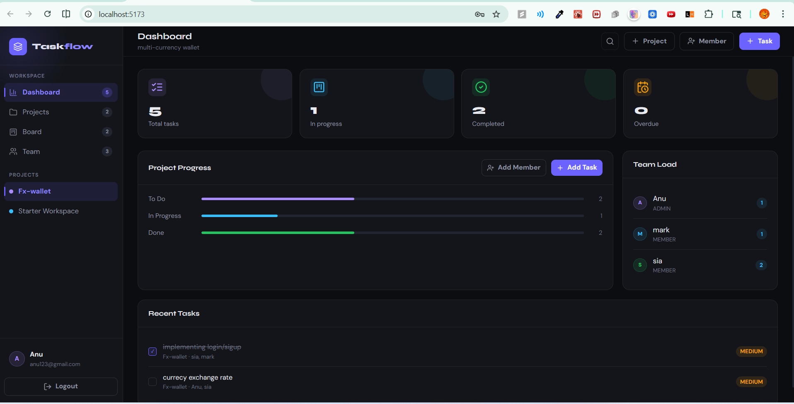

# Taskflow

Taskflow is a full-stack team task management app built with React, Spring Boot, and PostgreSQL.

It helps teams create projects, add members, assign tasks, and track progress. The app has role-based access, so Admins can manage projects and tasks, while Members can only see and update their assigned work.

## Live Links

Live App: https://taskflow-frontend.up.railway.app

API Base URL: https://taskflow-backend.up.railway.app/api

## Screenshot



## Tech Stack

| Layer | Technology |
| --- | --- |
| Frontend | React 18, Vite, CSS |
| Backend | Java, Spring Boot 3, Spring Security |
| Auth | JWT Bearer Token |
| Database | PostgreSQL, Spring Data JPA |
| Deployment | Railway |

## Features

- User signup and login
- JWT-based authentication
- Role-based access for Admin and Member
- Admin can create projects
- Admin can add and remove members
- Admin can create tasks
- One task can be assigned to multiple members
- Members can view only assigned projects and tasks
- Members can update assigned task status
- Dashboard shows total tasks, status count, user task count, and overdue tasks
- Overdue tasks are highlighted automatically

## Project Structure

```txt
taskflow/
├── frontend/
│   └── src/
│       ├── components/
│       ├── pages/
│       ├── utils/
│       ├── api.js
│       ├── App.jsx
│       ├── constants.js
│       ├── routes.js
│       ├── main.jsx
│       └── styles.css
│
└── backend/
    └── src/main/java/com/ethara/taskmanager/
        ├── api/
        ├── config/
        ├── domain/
        ├── repository/
        ├── security/
        └── service/
```

## Local Setup

### Prerequisites

- Java 17 or above
- Node.js 18 or above
- PostgreSQL installed and running

### Backend Setup

Create PostgreSQL database:

```sql
CREATE DATABASE team_task_manager;
```

Run backend:

```bash
cd backend
mvn spring-boot:run
```

Backend will run on:

```txt
http://localhost:8080
```

If your PostgreSQL username or password is different, set environment variables.

PowerShell example:

```powershell
$env:DATABASE_URL="jdbc:postgresql://localhost:5432/team_task_manager"
$env:DATABASE_USERNAME="postgres"
$env:DATABASE_PASSWORD="your_postgres_password"

mvn spring-boot:run
```

### Frontend Setup

```bash
cd frontend
npm install
npm run dev
```

Frontend will run on:

```txt
http://localhost:5173
```

If backend URL is different, create `.env` file inside `frontend`:

```env
VITE_API_URL=http://localhost:8080/api
```

## Deployment on Railway

I deployed this project using Railway with three services:

1. PostgreSQL database
2. Spring Boot backend
3. React frontend

Backend environment variables:

```env
DATABASE_URL=jdbc:postgresql://<host>:<port>/<database>
DATABASE_USERNAME=<username>
DATABASE_PASSWORD=<password>
JWT_SECRET=<random-secret-key>
CORS_ALLOWED_ORIGINS=https://taskflow-frontend.up.railway.app
```

Frontend environment variable:

```env
VITE_API_URL=https://taskflow-backend.up.railway.app/api
```

## API Endpoints

| Method | Endpoint | Access |
| --- | --- | --- |
| POST | `/api/auth/signup` | Public |
| POST | `/api/auth/login` | Public |
| GET | `/api/auth/me` | Authenticated |
| GET | `/api/projects` | Authenticated |
| POST | `/api/projects` | Authenticated |
| GET | `/api/projects/{id}/members` | Project Member |
| POST | `/api/projects/{id}/members` | Admin |
| DELETE | `/api/projects/{id}/members/{userId}` | Admin |
| GET | `/api/tasks` | Authenticated |
| POST | `/api/tasks` | Admin |
| PUT | `/api/tasks/{id}` | Admin |
| PATCH | `/api/tasks/{id}/status` | Assignee or Admin |
| PATCH | `/api/tasks/{id}/assignee` | Admin |
| DELETE | `/api/tasks/{id}` | Admin |
| GET | `/api/dashboard` | Authenticated |

## Test Credentials

Demo accounts are created when the database is empty.

| Role | Email | Password |
| --- | --- | --- |
| Admin | `admin@taskflow.com` | `admin123` |
| Member | `mahi12345@gmail.com` | `Mahi12345` |
| Member | `ravi@taskflow.com` | `password123` |
| Member | `priya@taskflow.com` | `password123` |

## Database Tables

Main tables used in this project:

```txt
users
projects
project_members
tasks
task_assignees
```

`task_assignees` is used because one task can be assigned to multiple members.

## Known Limitations

- No email verification
- No task comments
- No file attachments
- No notification system
- Mobile layout can be improved more
- More backend test cases can be added

## What I Would Improve

If I get more time, I would like to add:

- Email invitation for members
- Comments under tasks
- File upload for task attachments
- Notification system
- Search and filter for tasks
- Better mobile responsive design
- More backend and frontend tests

## Author

Anamika Patel

GitHub: [Anamika024](https://github.com/Anamika024)
